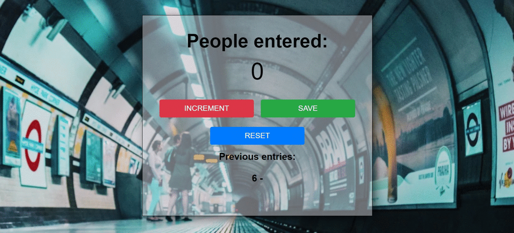

# Passenger Counter App



Did you know that The Tube is used by around 2 million people every day? How can we easily count them? It is amazing how small apps can be so helpful in certain professions. What else can we count with it?🔢🤔

## Built with

- HTML5
- CSS
- JavaScript
- VSCode

### What I practised

This challenge is a refresher for my HTML, CSS and JavaScript skills. I have been focusing on polishing my skills in order to make my code more readable and avoid duplication as much as possible. This is what I have learnt, it is great to use opacity to make your text stand out from the background image but if you set opacity in a parent element, the children also will get the opacity and we don't want that. How did I fixed it?
Instead of:
```
background-color: rgb(0,0,255); opacity: 0.5;
```
You can use:
```
background-color: rgba(0,0,255,0.5);
```
Basically you set the opacity inside the background so it won't affect the children elements.👏🌈


### Continued development

I will keep practising daily CSS/HTML to develop speed from creating a variety of basic components. I will keep learning javascript focusing on the basics. After finishing a bootcamp, I felt that there were many concepts that I have to master before creating more sophisticated apps. I would like to learn more about how things work rather than automating ways of doing things. 😊
