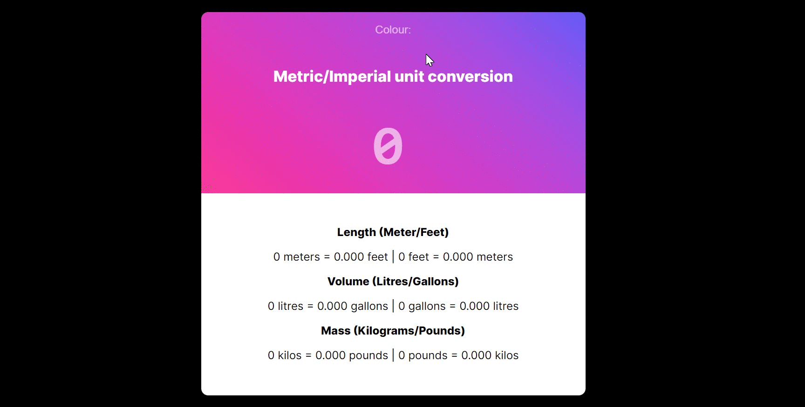

# Unit Converter App

This is a fun challenge from Scrimba(an amazing learning website!). If you follow their JavaScript course, this will be one of the challenges you will come across.

## Built with

- HTML5
- CSS
- JavaScript
- VSCode

### What I practised

This challenge is a refresher for my HTML, CSS and JavaScript skills. The minimum requirements for this challenge were:

- Save number to a variable in code.
- When app loads, do calculations and display the results.
- Round numbers to 3 decimal places.
- Use a CSS gradient generator.
- Challenge: Add an input for the user to change the number and automatically recalculate values when it changes.

The great thing of these kind of projects from Scrimba is that they are away from "tutorial hell" and let you do things on your own with little support at the end of the unit. It might feel a bit intimidating at first but once finished and feeling confident you can add extra features. 😎 This is what I added:

- Dropdown menu with different themes.🌈
- Get user input and display an error message when value goes below 0.⛔
- Styling the user input including the placeholder so that it matches the theme.🎨

### Continued development

I will keep practising daily CSS/HTML to develop speed from creating a variety of basic components. I will keep learning javascript focusing on the basics. After finishing a bootcamp, I felt that there were many concepts that I have to master before creating more sophisticated apps. I would like to learn more about how things work rather than automating ways of doing things. 😊
