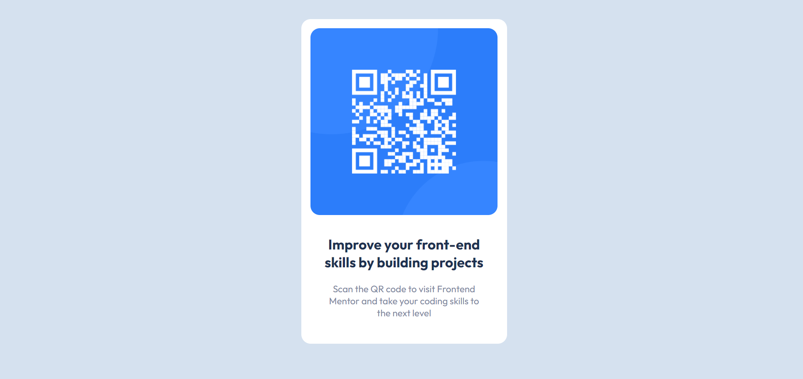

# Frontend Mentor - QR code component - original

# Frontend Mentor - QR code component - my design

* My card seems larger in the photo. However, the sizing in the browser is similar.

## Built with

- Semantic HTML5 markup
- CSS custom properties
- VSCode

### What I practised

This challenge is a refresher for my HTML and CSS skills. I have been focusing on polishing my skills in order to make my code more readable and avoid duplication as much as possible. I have used display:flex property to make sure the card sits in the center of the page. I didn't have much guidance in terms of padding and margin so I had to use my own judgement. If you get the pro version, you can have access to figma templates but I find it more challenging trying to replicate a component without a lot of information.

### Continued development

I will keep practising daily CSS/HTML to develop speed from creating a variety of basic components. I will keep learning javascript so I can combine these tools to create apps. I believe if you master the basics, it will be easier to use these skills to build something greater.

### Useful resources

- [A complete guide to flexbox](https://css-tricks.com/snippets/css/a-guide-to-flexbox/) - This helped me centering the elements of my card and the card itself. I constantly refer back to it. I recommend you bookmart it. 😊
- [flexbox frog game](http://flexboxfroggy.com/) - Do you like games? If you do and wanna learn more, have a look at this game. It has 24 levels and teaches you everything about flexbox. Can you master the 24 levels?🐸

## Esther... where did you get this challenge from?

- [Frontend mentor](https://www.frontendmentor.io/) - It is very useful as it provides with a very detailed README template (Like this one!). I would strongly recommend to write a README file in every project you do! ✍😎

Good luck!
